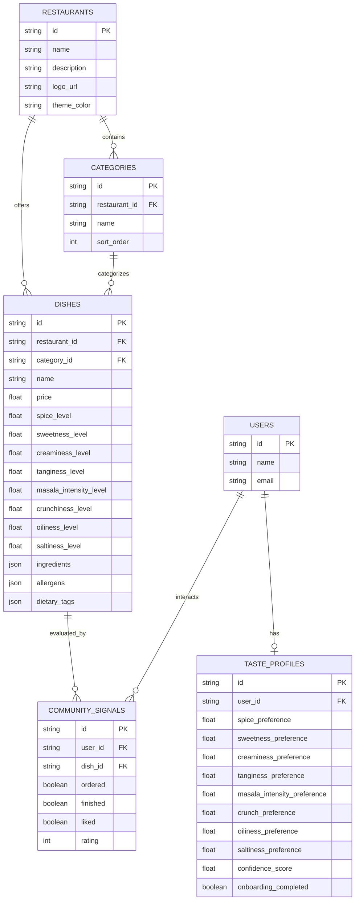

# TasteAI Database Schema & Data Models

## Overview
TasteAI uses SQLite for local development and supports PostgreSQL for production deployments via SQLAlchemy ORM. All primary keys are UUID strings.

---

## Entity Relationship Model

---

## Tables & Field Specs

### 1. `restaurants`
- `id`: `String(36)`, Primary Key UUID.
- `name`: `String(255)`, Restaurant name.
- `description`: `Text`, Optional description.
- `logo_url`: `String(512)`, URL to restaurant logo image.
- `theme_color`: `String(32)`, Branding primary color.

### 2. `categories`
- `id`: `String(36)`, Primary Key UUID.
- `restaurant_id`: `String(36)`, Foreign Key -> `restaurants.id`.
- `name`: `String(100)`, Category name (e.g. Starters, Sushi Rolls).
- `sort_order`: `Integer`, Ordering index.

### 3. `dishes`
- `id`: `String(36)`, Primary Key UUID.
- `restaurant_id`: `String(36)`, Foreign Key -> `restaurants.id`.
- `category_id`: `String(36)`, Foreign Key -> `categories.id`.
- `name`: `String(255)`, Dish name.
- `description`: `Text`, Detailed dish description.
- `price`: `Float`, Pricing in Indian Rupees (₹).
- `image_url`: `String(512)`, Dish image URL.
- `is_vegetarian`: `Boolean`, Vegetarian indicator.
- `is_available`: `Boolean`, Availability status.
- **8 Flavor Vectors** (`Float`, Range `0.0` - `1.0`):
  - `spice_level`, `sweetness_level`, `creaminess_level`, `tanginess_level`, `masala_intensity_level`, `crunchiness_level`, `oiliness_level`, `saltiness_level`.
- **JSON Metadata**:
  - `ingredients` (`JSON` array of strings), `allergens` (`JSON` array of strings), `dietary_tags` (`JSON` array of strings).

### 4. `users`
- `id`: `String(36)`, Primary Key UUID.
- `name`: `String(255)`, User display name.
- `email`: `String(255)`, Optional email address.

### 5. `taste_profiles`
- `id`: `String(36)`, Primary Key UUID.
- `user_id`: `String(36)`, Foreign Key -> `users.id`, Unique index.
- **8 Flavor Preference Vectors** (`Float`, Range `0.0` - `1.0`):
  - `spice_preference`, `sweetness_preference`, `creaminess_preference`, `tanginess_preference`, `masala_intensity_preference`, `crunch_preference`, `oiliness_preference`, `saltiness_preference`.
- `confidence_score`: `Float`, Score confidence metric (range `0.0` - `1.0`).
- `onboarding_completed`: `Boolean`, Status flag for quiz onboarding.

---

## Database Migrations & Seeding

- **Alembic**: Managed via `backend/alembic/`.
- **Seeding Script**: Executed via `python -m app.ingestion.seed_data`. Initializes the default restaurant entity ("Spice Symphony"), 5 categories, 12 dishes with Rupee pricing, and 15 simulated community profile signals.
