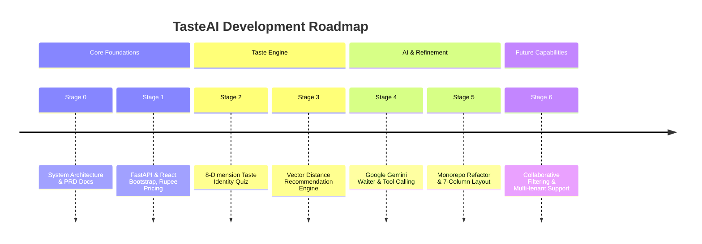

# TasteAI Development Roadmap

## Project Milestones

---

## Milestone Details

### Stage 0: Architecture & Design Specifications (Completed ✅)
- Defined strict separation of concerns (LLM for conversation, backend for logic).
- Standardized 8-dimensional Taste Vector Schema.
- Created technical documentation suite.

### Stage 1: Core Domain & Restaurant Experience (Completed ✅)
- Database schema modeling (SQLAlchemy ORM + Pydantic v2).
- REST API implementation for restaurant, categories, and dishes.
- Indian Rupee (`₹`) pricing standardization across backend seeds and frontend.

### Stage 2: Taste Identity System (Completed ✅)
- Interactive 8-question onboarding quiz.
- Baseline-delta algorithm calculation (50% baseline + targeted deltas).
- Animated Taste Identity vector progress bars on profile page.

### Stage 3: Deterministic Recommendation Engine (Completed ✅)
- Weighted Euclidean distance and cosine similarity scoring.
- Rule-based explainability reason generator.
- Main page Top Recommendation carousel integration.

### Stage 4: AI Dining Assistant (Completed ✅)
- Google Gemini provider integration via `google-genai` / `OpenAI` client interface.
- Context Builder injecting user profile, menu data, and page location.
- Tool Calling executor dispatching UI actions (`HIGHLIGHT_DISH`, `NAVIGATE`, `COMPARE_DISHES`, `ADD_TO_CART`).

### Stage 5: Monorepo Architecture & Desktop Refinement (Completed ✅)
- Refactored repository into standard layered monorepo (`app/routes`, `app/config`, `app/middleware`, `app/ai/*`, `src/pages`, `src/components`, `src/hooks`, `src/services`).
- Desktop high-density grid (`2xl:grid-cols-7`).
- Comprehensive Dish Details View (ingredients pills, allergen alerts, dietary tags, chef's notes, dish flavor vectors).

---

## Future Capabilities (Stage 6)

1. **Multi-Tenant Restaurant Isolation**: Enable multiple restaurant entities with custom vector weights and menu catalogs.
2. **Collaborative Filtering ML Integration**: Upgrade community signal matching with matrix factorization models for hybrid recommendation scores.
3. **Offline Progressive Web App (PWA)**: Add service worker caching for offline menu browsing.
4. **Kitchen Order Execution (KDS)**: Real-time WebSocket updates for active cart orders.
